# Anki 复习数据清洗与分析

最近开始测试一些间隔重复算法，需要收集一些复习数据，如果大家感兴趣，可以按照本文的教程分析你的复习数据。

## 获取原始数据

### 数据库查看工具

Anki 的数据库用的是 SQLite，推荐使用 DB Browser for SQLite 来查看和导出复习数据

下载地址：http://www.sqlitebrowser.org/dl/

### 打开 Anki 数据库

下载并安装好上面这个工具之后，按照以下步骤即可打开 Anki 数据库：

1. 打开 DB Browser，文件 > 打开数据库

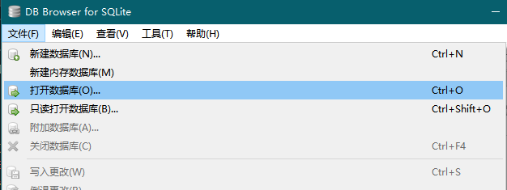

2. 找到你 Anki 本地数据库的位置，通常这个位置是 `C:\Users\你电脑的用户名\AppData\Roaming\Anki2\你 Anki 本地配置的名称\`

记得把右下角这个改成所有文件，因为 Anki 的数据库后缀不是 db 也不是 sqlite。

改好后如果你找到的位置是对的，那么就能看到 `collection.anki2` 的文件了

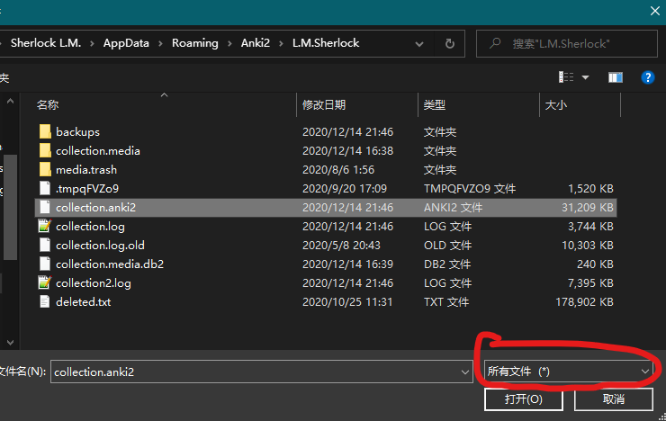

3. 提取数据

打开后转到执行 SQL，输入以下 SQL 语句：

```sql
SELECT id, cid, ease, lastIvl, type
FROM revlog
WHERE type != 2
;
```

然后点

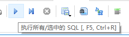

就能得到以下结果

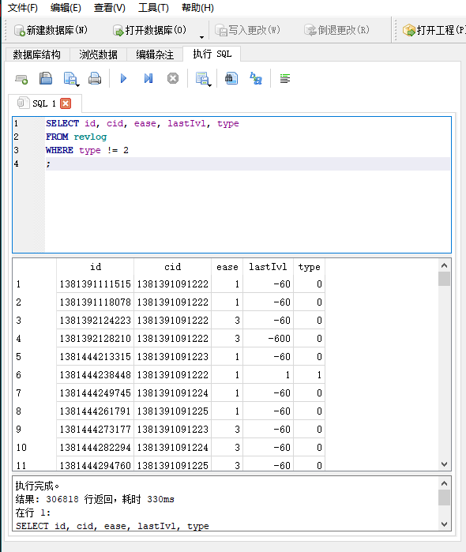

再点击

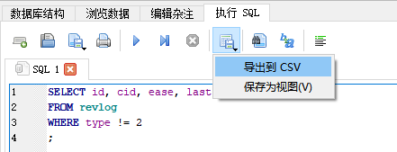

就能将数据导出成 csv 格式，用 excel 打开就能看到这样的数据：

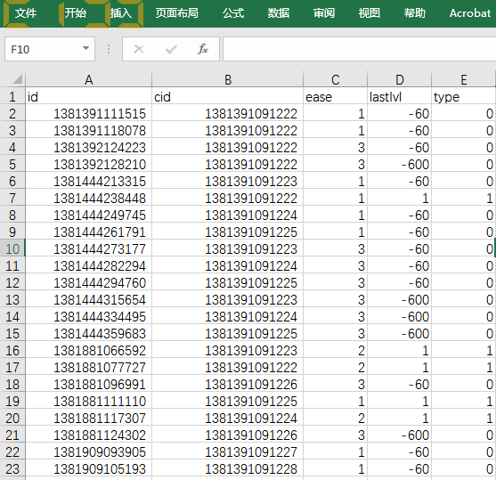

里面没有关于卡片内容的敏感数据，大家可以安心分享。欢迎将你的 .csv 文件发送到我的邮箱地址：jarrett.ye@outlook.com，或者在专栏读者群(869469893)分享，也可以发送你的网盘分享链接。

作为回报，我会将以下分析数据反馈给你。（如果你有想要分析的其它指标，也可以跟我提，如果基于目前的数据可以分析，我也会反馈给你）

## Anki 数据分析

### 不同反馈对应的记录数量

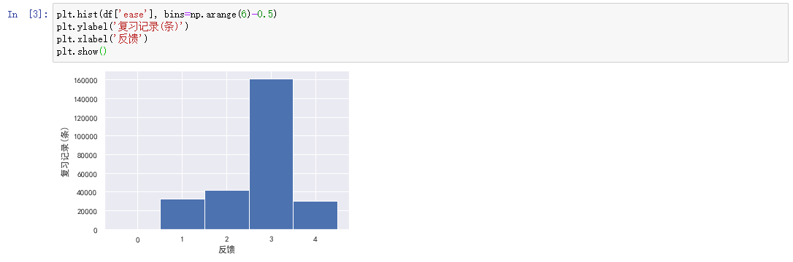

### 总体遗忘/保留情况

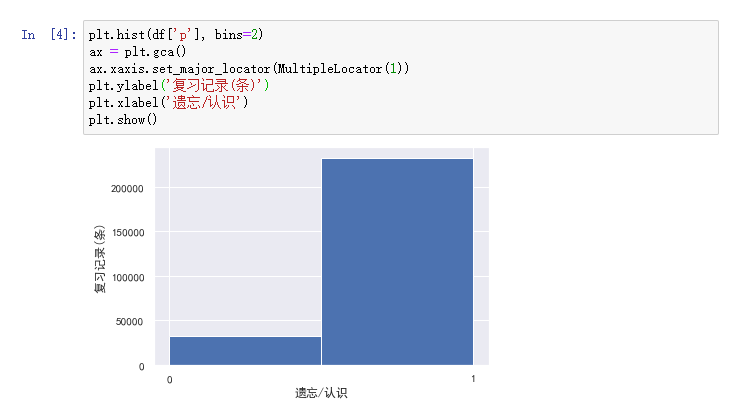

### 不同间隔下的复习记录数量

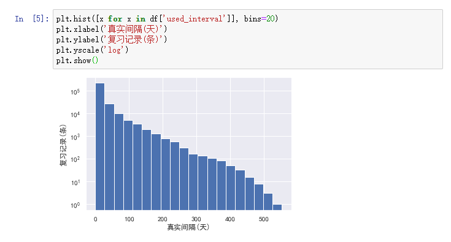

### 不同间隔区间对应的保留率

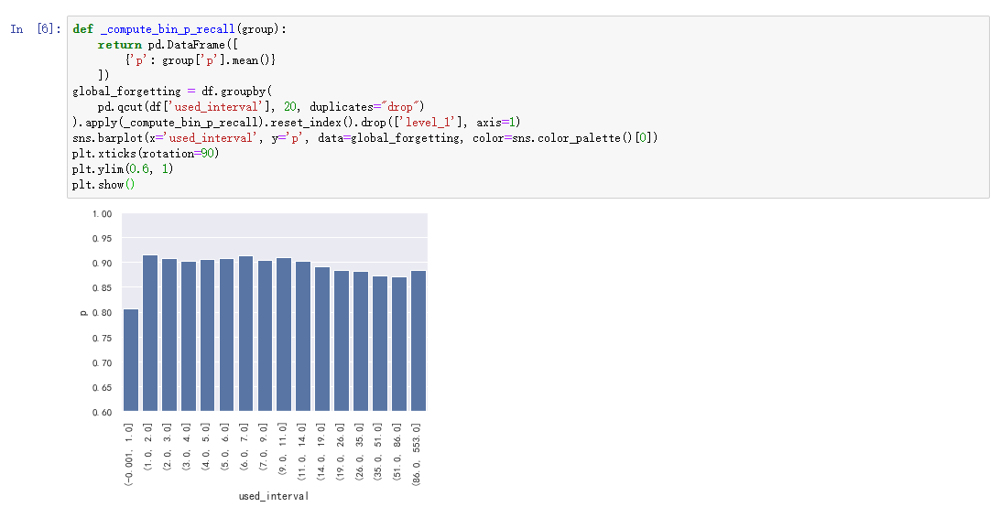

### 不同复习次数对应的保留率

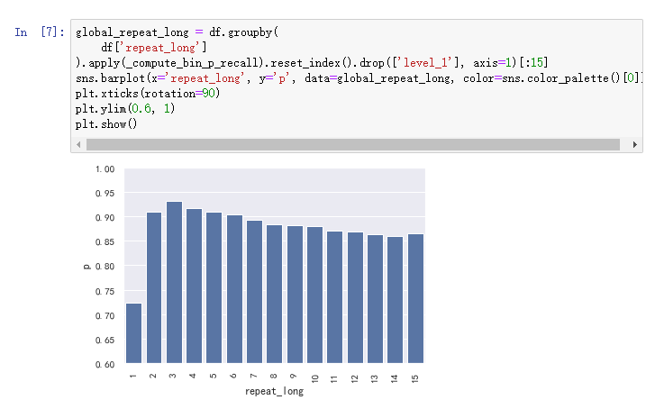

### 不同累计遗忘次数对应的记录数量

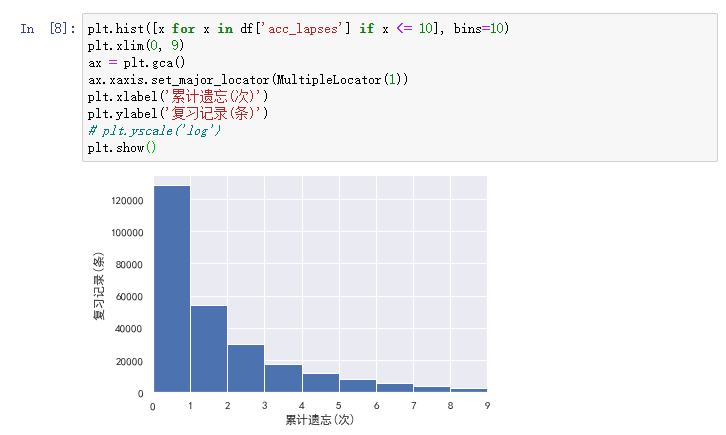

还有一些其它的指标，如果你有任何建议或者意见，欢迎留言。

另外，以上代码都开源在我的 GitHub 仓库：

https://github.com/L-M-Sherlock/anki_revlog_analysis

如果想要自己分析可以直接下载源码运行。

感谢大家的支持！


2020 年 12 月 15 日

叶峻峣